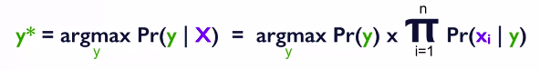
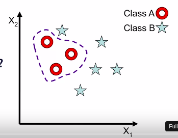
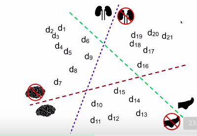
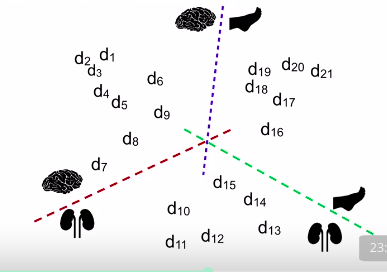

Applied Text Mining in Python
==============================

by University of Michigan

# Module 3
#
## Title: Classification of Text

### Text Classification

* What is **Classification**
	* You have a given set of classes, which we have to assign to given input
	* Classification: Is the task is to assign the correct class label to a given input
* Example:
	1. **Topic Identification**
		* if you are looking at a news article, and depending on which page of the newspaper it belongs to, you would want to categorize it as politics, sports, or technology.
	1. **Spam Detection**
		* you get an email and you want to label that email as a spam or not a spam
		* is this email spam or not?
	1. **Sentiment Analysis**
		* is this movie review positive or negative
	1. **Spelling Correction**
		* weather or whether? --> weather is great or whether is great
		* color or colour?
* Supervised Learning
	* Humans learn from past **experiences**, machines learn from past **instances**
	* In supervised Classification task there are
		1. **Training Phase**
			* where information is gathered and a model is built
		1. **Inference Phase**
			* where that model is applied
	* **Supervised Classification**
		* Learn a Classification Model on **properties** ('**features**') and their **importance** ('**weights**') from labeled instances
			* **X** : Set of attributes or features {x<sub>1</sub>, x<sub>2</sub>, ..., x<sub>n</sub>}
			* **y** : A "class" label from label set Y = {y<sub>1</sub>,y<sub>2</sub>,...,y<sub>k</sub>}
		* Apply the model to new instances to predict the labels
	* **Phases and Datasets**
		* **Training Phase**
			* This phase has labeled dataset
			* We don't use entire dataset for training purpose
				* We use part dataset for training, we call it **training dataset**
				* Remaining dataset is known as **validation dataset** or **holdout dataset**, this dataset is used to validate the model
		* **Inference Phase**
			* In general in this phase we have unlabeled dataset
			* that is, we don't have **y**
			* **Unseen dataset** is used in this phase to check the performance of model
	* **Classification Paradigm**
		* When there are only two possible classes; |Y| = 2
			* This is known as **Binary Classification**
			* like yes/no, true/false, spam/not spam, etc..
		* When there are more than two classes; |Y| > 2
			* This is known as **Multi-class Classification**
		* When data instances can have two or more labels
			* This is known as **Multi-label Classification**
	* **Questions** to **ask** in Supervised Learning
		* **Training Phase**
			1. What are the features? How do you represent them?
			1. How do you represent the input given to you?
			1. What is a classification model or the algorithm you're going to use?
			1. What are the model parameters, depending on the model you use?	
		* **Inference Phase**
			1. what are the expected performance measures?
			1. What is a good measure?
			1. How do you know that you have built a great model?
			1. What if a performance measure you'll use to determine that?

### Identifying Features from Text

* Types of Textual Features (1)
	* Words
		* These are by far most common class of features
		* Handling commonly-occuring words: Stop Words, like the, a, an, etc...
		* **Normalization**: Make lower case vs leave as-is
			* do you make all the words lower case
			* or should we leave it as is
			* In some cases we leave it as is and in some case we convert it to lower, like US is left as is, other it gets similar to us, and in case of Parliament we can convert it to lower case, so that all parliament can be considered same.
		* **Stemmign** and **Lemmatization**
			* For example, you don't want plurals to be different features. So you would want to lemmatize them or to stem them. Then, all of this is still about words
* Types of Textual Features (2)
	* **Characteristics of words**: Capitalization
		* Example: White House, with the W capitalized and the H capitalized, it's very different than white house, a white house
		* So, capitalization is important feature to identify certain words and their meanings
	* **Part of Speech** of words in a sentence
		* For example if it's important to say that this particular word had a determinant in front	
			* So then that becomes an important feature
				* example would be the weather or whether example
	* Grammatical structure, **sentence parsing**
		* to see what is the verb associated with a particular noun. How far is it from the associated noun and so on
	* Grouping words of similar meaning, **semantics**
		* An example would be buy, purchase
		* These are all synonyms, and you don't want to have two different features, one for buy, one for purchase, you may want to group them together because they mean the same, they have the same semantics
		* There could also be other groups like
			* {Mr., Ms., Dr., Prof.}
			* Numbers/Digits --> because you don't want to specifically have a feature for zero and other features for one, and so on, all the numbers
			* Dates
* Types of Textual Features (3)
	* Depending on classification tasks, features may come from inside the word and word sequences
		* **Bi-grams, Tri-grams, n-grams**
			* example would be bigrams or trigrams
				* The White House example comes to mind. Where you want to say, White House, as a two word construct as a bigram is conceptually one thing
		* Character sub-sequencing in words
			* like "ing", "ion", etc...
			* just by looking at it you know that **ing** is basically saying it is a word in its continuous form
			* **ion** more likely at the end of a word would be a noun of some form

### Naive Bayes Classifiers

* **Bayes' Rule**
	* Posterior Probability = (Prior Probability * Likelihood)/Evidence
		* P(y | X) = ( P(y) * P(X | y) ) / P(X)
* **Naive Bayes Classification**
	* **Naïve Bayes** classification model just is interested in which of the **N** labels is more likely. So you know that y belongs to one of the **N** classes
	* `y* = argmax P(y | X) = argmax P(y) * P(X | y)`
		* the true label, or the predicted label I should say, `y*` is the **y** that maximizes probabilit of **y** given **X**
			* And then that computation it does not matter what the probability of X itself is
	* **Naive Assumption**
		* Given the class label, features are assumed to be independent of each other
		* That is given the label is y, probability of capital X given y is just individual feature probabilities
		* Probability of x_i given a product of all of those. That's the product that goes from the first feature to the end feature
	* So the formula stands like
		* The predicted label y is the y that maximizes, the argument that maximizes this computation of probability of y given X. Which is computed using Bayes Rule as probability of y, that is the prior, times T independent products of individual features given y. So that's the likelihood of probatility of capital X given y
		<p align="center">
		  <a href="javascript:void(0)" rel="noopener">
		 </a>
		</p>
* Naive Bayes: What are the **parameters**?
	* **Prior Probabilities** - are these probabilities for each of the classes in your set of classes
		* P(y) for all y in Y
	* **Likelihood**
		* that this probability of seeing a particular feature in documents of class y
		* The probability of x_i given y that is import, no, that is needed for all features x_i and all labels y in Y
			* So it's a combination of every feature in each of these classes that you have
		* P(x<sub>i</sub> | y) for all features x<sub>i</sub> and labels y in Y


> Q: You are training a naïve Bayes classifier, where the number of possible labels, |Y| = 3 and the dimension of the data element, |X| = 100, where every feature (dimension) is binary. How many parameters does the naïve Bayes classification model have?

> A: A naïve Bayes classifier has two kinds of parameters:
	Pr(y) for every y in Y: so if |Y| = 3, there are three such parameters.
	Pr(x<sub>i</sub> | y) for every binary feature x<sub>i</sub> in X and y in Y. Specifically, for a particular feature x<sub>1</sub>, the parameters are Pr(x<sub>1</sub> = 1 | y) and Pr(x<sub>1</sub> = 0 | y) for every y. 
		So if |X| = 100 binary features and |Y| = 3, there are (2 x 100) x 3 = 600 such features
	Hence in all, there are 603 features.

> **Note** that not all of these features areindependent. In particular, Pr(x_i = 0 | y) = 1 - Pr(x_i = 1 | y), for every x_i and y. So, there are only 300 independent parameters of this kind (as the other 300 parameters are just complements of these). Similarly, the sum of all prior probabilities Pr(y) should be 1. This means there are only 2 independent prior probabilities. In all, for this example, there are 302 independent parameters.

* Naive Bayes: **Learning parameters**
	* **Prior Probabilities** - P(y) for all y in Y
		* Count the number of instances in each class
		* If there are **N** instances in all, and **n** out of those are labeled as class **y**, then
			* `P(y) = n/N`
	* **Likelihood** - P(x<sub>i</sub> | y) for all features x<sub>i</sub> and labels y in Y
		* Count how many times feature x<sub>i</sub> appear in instances labeled as class **y**
			* for example, you will only look at documents that belong to the computer science class and among those you would count how many times Python appears
				* Or you would look at all the queries that we will call entertainment and then look for word like "actor" and see how many times the word "actor" occurs in those queries
		* If there are **p** instances of class **y**, and x<sub>i</sub> appears in **k** of those, 
			* **P(x<sub>i</sub> | y) = k/p**
* Naive Bayes: **Smoothing**
	* What happens when P(x<sub>i</sub> | y) = 0
		* When a feature x<sub>i</sub> never occurs in documents labeled **y**
		* But then, the posterior probability P(y | x<sub>i</sub>) will be 0
	* Instead, smooth the parameters
	* **Leplace** smoothing, or **Additive** smoothing : Add a dummy count
		* add count of one to every word in every class
		* This does not change the order probability significantly because that's the way we are computed these probabilities
			* These are called "maximum likelihood estimations" that typically good when you have large numbers but they're not so good when you have very small numbers
		* P(x<sub>i</sub> | y) = (k+1)/(p+n)
			* where, **n** is number of features

#### Review

* Naive Bayes is a probabilistic model and it is called Naive 
* It is called Naive because it assumes that features are independent of each other given the class label
* It is Naive because it's actually not necessarily true even for text
	* for example, the fact that you have "White House" as two words but together having a significantly different meaning. If you see the word "White" with a capital W, the chance that it is followed by "House" is very high. So these two features of "White" and "House" are not really independent of each other
	* But Naïve Bayes models kind of ignored that. They say that given the class label, I'm assuming all features are independent because the math on how you can compute the probabilities becomes easy
* for text classification problems, Naïve Bayes models actually typically provide very strong baselines
	* It is traditionally the first one you should try because. It will give you the benchmark or a baseline that is pretty strong
* It's a very simple model to learn. The parameters are very easy to understand and to learn because they are just counts
	* they are just counts counted in different ways


### Naive Bayes Variations


* Two Classic Naive Bayes Variants for Text
	1. **Multinomial Naive Bayes Model**
		* The Multinomial Naïve Bayes model is one in which you assume that the data follows a multinomial distribution
			* It means that when you have the set of features that define a particular data instance, we're assuming that these each come independent of each other and can also have multiple occurrences or multiple instances of each feature
			*  So, counts become important in this multinomial distribution model
		* Each feature value, a some sort of a count or a weighted count. 
			* Example word occurrence counts or TF-IDF weighting and etc...
		* Suppose you have a piece of text, a document, and you are finding out what are all the words that were used in this model. That would be called a bag-of-words model
		* if you just use the words, whether they were present or not, then that is a Bernoulli distribution for each feature
			* So, it becomes a multivariate Bernoulli when you're talking about it for all the words
		* But if you say that the number of times a particular word occurs is important, so for example, if the statement is to be or not to be, and you want to somehow say that the word to occur twice, the word be occur twice, the word or occur just once and so on, you want to somehow keep track of what was the frequency of each of these words
			* And then, if you want to give more importance to more rare words, then you would add on something called a **term frequency**, **inverse document frequency** weighting
			* So you don't, not only give importance to the frequency, but say how common is this word in the entire collection, and that's what the idea of weighting comes from
				* for example, the word THE is very common, it occurs on almost every sentence, it occurs in every document, so it is not very informative
					* But if it is the word, like, SIGNIFICANT, it is significant because it's not gonna be occurring in every document. So, you want to give a higher importance to a document that has this word significant as compared to the word the, and that kind of variation in weighting is possible when you're doing a **multinomial Naïve Bayes** model
	1. **Bernoulli Naive Bayes Model**
		* Data follows a multivariant Bernoulli distribution
		* Each feature is binary (either word is present or absent)
			* it's only that information about just the word being present that is significant and modeled and it does not matter how many times that word was present
			* In fact, it also does not matter whether the word is significant or not in the sense that is the word THE, which is fairly common in everything, or is the word something like SIGNIFICANT, which is less common in all documents
		* So when you have just the binary features, I mean, just a binary model for every feature, then the entire data, the set of features follows what is called a **multivariate Bernoulli** model
		* You would want to go the Bernoulli route, especially if you want to somehow say that the frequency is immaterial and it's just whether the presence or absence of a word that is more important.

### Support Vector Machines

> One vs Rest approach takes one class as positive and rest all as negative and trains the classifier. 
	So for the data having n-classes it trains `n classifiers`. Now in the scoring phase all the n-classifier predicts probability of particular class and class with highest probability is selected.
#
> One vs One considers each binary pair of classes and trains classifier on subset of data containing those classes. So it trains total `n*(n-1)/2` classes. 
	During the classification phases each classifier predicts one class. 
	(This is contrast to one vs rest where each classifier predicts probability). And the class which has been predicted most is the answer

* **Decision Boundaries**
	* Example
		* There are just two dimensions, X1 and X2, and there are points, leader points in this two dimensional in space. Some of them are marked star, others are marked circle. Let's call the circle ones as Class A, and the stars as Class B
		* Now you need to somehow make a boundary around one of the classes to separate that from the other class
			* You can use any decision boundary, you could use one that is a circle, or you could use one that's a square, or you could have any other random shape, in this case let's take a shape of a heart
			* A classification function is represented by this **decision surface**, or **decision boundary**
			<p align="center">
			  <a href="javascript:void(0)" rel="noopener">
			 </a>
			</p>
	* Whenever you use a decision boundary, the main purpose is when you get a new point that is unlabeled, depending on the decision boundary you have learned, you can label it as one of the classes
* **Data Overfitting**
	* Decision boundary learned over training data does not generalize to test data
* **Linear Boundaries**
	* Easy to find
		* Because you have to basically learn a line that maximally separates these two points, that that makes as fewer errors as positive, as possible, and you can see that there is no one line that could have separated the positives from negatives completely
	* Easy to evaluate
		* Because now you have a very simple rule that any point in this entire half-space and half-region that's on the positive side is going to be called **positive**
		* Any point on the other side is going to be called **negative**
	* Occam's Razor
		* Idea of using a simple classifier or a simple model to fit the data, Is called Occam's Razor, these are more generalized
		* The rule of thumb here is simple models generalize well
		* You want to use something that is simple to explain, that would work very well in the test data
		* Overall this is still a much better model than this irregular shaped boundary 
* Finding a Linear Boundary
	* when you're finding a linear boundary, you're finding **W**, or the **slope** of the line
		* You basically want to find out the coefficients that are the weights associated with the dimensions X1 and X2, so W is typically of the same dimension, same size as your data points
		* You are going to use a linear function to see which point would be called positive or negative
	* Methods which can be used
		1. Perceptron
		1. Linear Discriminative Analysis
		1. Linear Least Square
* Pros of Margins in SVM
	* A small change in your data points would still not change the label that this particular classifier will assign that
	* It's more **resistant** to **noise** or **perturbations**
	* This idea is called **maximum margin**
		* You would want to learn the thickest band that you can fit, that separates the positive points from negative points
		* This band, or the thickness is called the margin, and the middle line between them is called the actual hyperplane
			* that's the **maximum margin hyperplane**
		* The idea here is that you are not basing your classifier on two points, a positive and negative point, but a set of points called **support vectors**
			* in general, the support vector machine are **maximum margin classifier**
			<p align="center">
			  <a href="javascript:void(0)" rel="noopener">
			 </a>
			</p>
			* these support vectors are the points that are the most sensitive to shift. But even then, small changes or perturbations to support vectors still would not change the classification, because classification happens with respect to this maximum margin hyperplane
* Support Vector Machines (SVM)
	* These are linear classifiers that find a hyperplane to separate two classes of data
		1. Positive
		1. Negative
	* Given training data
		* (x<sub>1</sub>,y<sub>1</sub>), (x<sub>2</sub>,y<sub>2</sub>), ...
			* where x<sub>i</sub> = (x<sub>1</sub>,x<sub>2</sub>,...,x<sub>n</sub>) is instance vector
				* y<sub>i</sub> is one of {-1, +1} --> Negative or Positive class
			* where Xs are the representations of the data in terms of its features, as opposed to any dimensional feature representation
				* you have the Ys as the class label, which is one of two labels here, -1 and +1
			* then SVM will find the **linear function** **W**, a **weight vector**, such that the function of f, of X<sub>i</sub>, is this dot product of W and X<sub>i</sub>, so W.X<sub>i</sub> with some bias term
				* the idea is that if the value for a new X<sub>i</sub>. If the function leads to a positive value, of X<sub>i</sub> is greater than zero, then the label is +1, otherwise the label is -1
				* f(x<sub>i</sub>) =< w.x<sub>i</sub> > + b
					* if f(x<sub>i</sub>) >= 0,
						* y<sub>i</sub> = +1
					* else y<sub>i</sub> = -1
	* SVM tend to work only for binary classification problems
		* we have seen an example of this, +1 and -1
	* When you want to use SVM for multi-class classification
		* you would want to learn it in one of two scenarios
			1. One vs Rest 
				* Where you are actually learning binary classifiers between one class and all the other classes together
				* So, for **n** class setup, we are learning **n** classifiers, such that all the points in one region
					<p align="center">
					  <a href="javascript:void(0)" rel="noopener">
					 </a>
					</p>
			1. One vs One
				* **n** class SVN has C(n, 2) classifiers
					<p align="center">
					  <a href="javascript:void(0)" rel="noopener">
					 </a>
					</p>
* SVM Parameters (1)
	* One of the most critical parameters becomes parameter **C**, and that defines **regularization**
	* **Regularization** is a term that denotes how important it is for individual data point to be labeled correctly, as compared to all the points in the general model
		* larger value of **C**, that means the regularization is less, and that means that you are fitting the training data as much as possible
			* You are giving the individual points a lot of importance, and every data point becomes important. You want to get them right, even if the overall accuracy is low, or generalization error is high
		* smaller values of **C** means that are more regularization, where you are tolerant to errors on individual data points, as long as in the overall scheme you are getting simpler models
			* So the generalization error is expected to be low
	* The default values in most of the packages is 1
	* The other parameters are typically with respect to what is the type of a decision boundary you would want to learn
		* **Linear Kernel** usually works best with text data
			* Other kernels include **rbf**, **polynomial** 
		* multi_class: ovr(one-vs-rest)
			* with one-vs-rest, you are learning fewer number of classifiers. So that's preferred over one-vs-one
		* class_weight: different class can get different weights


#### Review

1. SVMs tend to be most accurate classifiers for text, especially when we are talking about high-dimensional data
1. Strong theoritical foundation
	1. It's based out of optimization theory
1. Support vector machine handles only numeric data
	1. Typically you can convert textual data categorical features into numeric features
		* As you can see this is a dot product based algorithm
		* So it uses numbers to define whether it should be boundary on one side or the other.
	1.  You would also want to normalize the features
		* so that each feature gets enough importance and you can learn the relative importance that way
1. Hyperplane hard to interpret
	* they're very easy to learn and easy to test, they are hard to interpret 
	* Which means that you don't really know why a particular point has been labelled as positive or negative. It's a combination of multiple factors
		* But in general if explanation is not a critical requirement for the classifier, support vector machines do give you very high and very accurate classifiers, very similar to naive bayes

### Learning Text Classifiers in Python

* Toolkits for Supervised Text Classification
	1. scikit learn
	1. nltk
		* it interfaces with sklearn and other ML toolkits like Weka
* Scikit Learn
	* Scikit-learn is an open-source machine learning library
	* It started as a Google summer of code in 2007
	* Has very strong programmatic interface
		* especially, when you compare it against Weka which is a more graphical user interface or primarily driven as the user interface model
	* Scikit-learn has predefined classifiers
		* The algorithms are already there for you to use
* Scikit Learn's Naive Bayes Classifier usage sample
	```python
	from sklearn import naive_bayes
	clfNB = naive_bayes.MultinomialNB()
	clfNB.fit(train_data, train_labels)
	predicted_labels = clfNB.predict(test_data)
	metrics.f1_score(test_labels, predicted_labels, average='micro')
	```
* Scikit Learn's SVM Classifier usage sample
	```python
	from sklearn import svm
	## SVC - Support Vector Classifier
	# Default value for kernel is 'rbf'
	# Default value for C is 1
	clfSVM = svm.SVC(kernel='linear', C=0.1)
	clfSVM.fit(train_data, train_labels)
	predicted_labels = clfSVM.predict(test_data)
	```
* Model Selection
	1. One is keeping some part of printing the label data set separate as the hold out data
		* When you do it this way, you are losing out a significant portion of your training data into test. Remember, that you cannot see the test data when you're training the model
	1. Cross Validation
		* Common to use 10-fold cross-validation especially when you have a large data set
		* It's fairly common to run cross-validation multiple times. So that you have reduced variance in your results
	* Both these models are trained to split and cross-validation are fairly commonly used and critical when you're doing any model selection
* NLTK
	* NLTK has some classification algorithms
		1. Naive Bayes Classifier
		1. Decision Tree Classifier
		1. Conditional Exponential Classifier
		1. Maxent Classifier
		1. Weka Classifier
		1. Sklearn Classifier
* NLTK's Naive Bayes Classifier usage sample
	```python
	from nltk.classify import NaiveBayesClassifier
	clfNB = NaiveBayesClassifier.train(train_set)
	clfNB.classify(unlabled_instance) # for instance
	#
	clfNB.classify_many(unlabled_instance) # for more than one instance
	nltk.classify.util.accuracy(clfNB, test_set)
	clfNB.labels() # Gives you all the labels that this classifier has trained on
	clfNB.show_most_informative_features() # gives most important or informative features of classifier
	```
* NLTK's Sklearn Classifier usage sample
	```python
	from nltk.classify import SklearnClassifier
	from sklearn.naive_bayes import MultinomialNB
	from sklean.svm import SVC
	clfNB = SklearnClassifier(MultinomialNB()).train(train_set)
	clfSVM = SklearnClassifier(SVC(), kernel='linear').train(train_set)
	```

#### Review

1. Scikit-learn is most commonly used ML toolkit in python
1. NLTK has its own naive Bayes implementation
1. NLTK can also interface with Scikit-learn (and other ML toolkits like Weka)

### Case Study - Sentiment Analysis

##### Count Vecotrizer

* CountVectorizer allows us to use the bag-of-words approach by converting a collection of text documents into a matrix of token counts.
* Fitting the CountVectorizer consists of the tokenization of the trained data and building of the vocabulary.
* Fitting the CountVectorizer tokenizes each document by finding all sequences of characters of at least two letters or numbers separated by word boundaries. Converts everything to lowercase and builds a vocabulary using these tokens.
* We can get the vocabulary by using the get_feature_names method.
* transform the documents in the training data to a document-term matrix
* giving us the bag-of-word representation of X_train.
* This representation is stored in a SciPy sparse matrix, where each row corresponds to a document and each column a word from our training vocabulary.
* The entries in this matrix are the number of times each word appears in each document.
* Because the number of words in the vocabulary is so much larger than the number of words that might appear in a single review, most entries of this matrix are zero

##### TF-IDF

* Tf–idf, or Term frequency-inverse document frequency, allows us to weight terms based on how important they are to a document.
* High weight is given to terms that appear often in a particular document, but don't appear often in the corpus
* Features with low tf–idf are either commonly used across all documents or rarely used and only occur in long documents
* Features with high tf–idf are frequently used within specific documents, but rarely used across all documents.
* Because tf–idf vectorizer goes through the same initial process of tokenizing the document, we can expect it to return the same number of features.
* CountVectorizor and tf–idf Vectorizor both take an argument, mindf, which allows us to specify a minimum number of documents in which a token needs to appear to become part of the vocabulary.
	* This helps us remove some words that might appear in only a few and are unlikely to be useful predictors
		* For example, here we'll pass in min_df = 5, which will remove any words from our vocabulary that appear in fewer than five documents.

##### n-grams

* It adds sequences of word features known as n-grams.
* bigrams, which count pairs of adjacent words
	* could give us features such as is working versus not working
* trigrams, which give us triplets of adjacent words
	* could give us features such as not an issue

