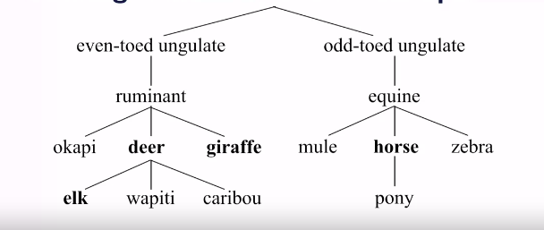
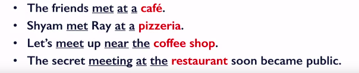
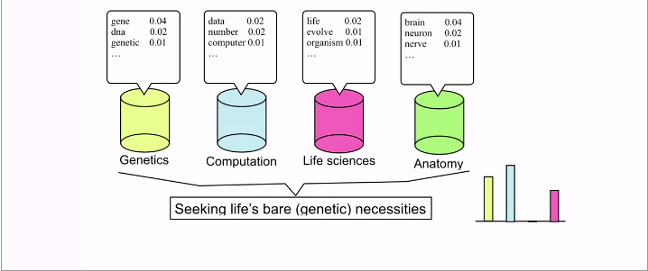
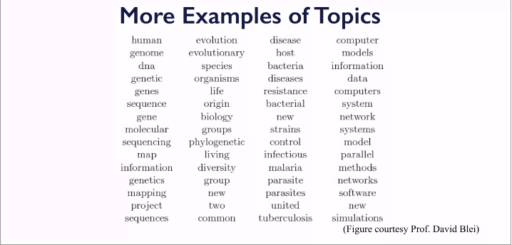
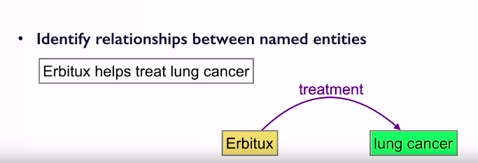
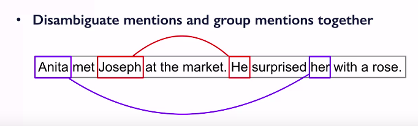

Applied Text Mining in Python
==============================

by University of Michigan

# Module 4
#
## Title: Topic Modeling

### Semantic Text Similarity

* Applications of **Semantic Similarity**
	* Grouping similar words into semantic concepts
	* Semantic similarity is useful when you're grouping similar words into semantic concepts into concepts that appear to have the same meaning
	* Semantic similarity is very useful as a building block in natural language understanding **Tasks**
	* **Tasks** such as 
		1. **Textual entailment**
			* Textual entailment, on the other hand, is a little bit more complex
			* It says that the smaller sentence or one of the two sentences derives its meaning or entails its meaning from another piece of text
				* So you have a text document or a text passage and a sentence. And based on the information in the text passage, you need to say whether the sentence is correct or it derives its meaning from there or not
			* This is a typical task of semantic similarity
		1. **Paraphrasing**
			* Paraphrasing is a task where you rephrase or rewrite some sentence you get into another sentence that has the same meaning
* **Wordnet**
	* One of the resources useful for semantic similarity is WordNet
	* **WordNet** is a semantic **dictionary** of words **interlinked** by **semantic** relationships
	* It is most extensively developed in English, but there are WordNets available now for quite a few languages
	* This WordNet includes a rich linguistic information
		* For example, 
			* It has the Part of Speech, whether something is a noun or an adjective or a verb
			* A word senses, different meanings of the same word, synonyms, other words that mean the same, hypernyms and hyponyms, that is an is/are relationship
				* For example, a deer is a mammal or meta-name that is a whole and part of relationship and derivationally related forms
	* WordNet is also a machine readable and it's freely available, so it is extensively used in a lot of **natural language processing** tasks and, in general, in **text mining** tasks
	* How do you use WordNet for semantic similarity? 
		* WordNet organizes information in a hierarchy, in a tree
		* You have a dummy root that is on top of all words of the same part of speech
			* So noun has a dummy root
			* A verb has a dummy root
			* And then, there are many semantic similarity measures that are using this hierarchy, in some way
* **Path Similarity**
	* Find the shortest path between two concepts
	* Similarity can be measure inversely related to path distance
		* PathSimilarity, PathSim(deer, elk) = 1 / (Distance between Deer&Elk + 1) = 1/2 = 0.5
		* PathSimilarity, PathSim(deer, giraffe) = 1 / (Distance between Deer&Giraffe + 1) = 1/3 = 0.33
		* PathSimilarity, PathSim(deer, horse) = 1 / (Distance between Deer&Horse + 1) = 1/7 = 0.14
		<p align="center">
		  <a href="javascript:void(0)" rel="noopener">
		 </a>
		</p>
* **Lowest Common Subsumer** (**LCS**)
	* **LCS** is another way to find similarity between two concepts
	* Find the closest ancestor to both concepts
	* Lowest common subsumer is that ancestor that is closest to both concepts
		* For example
			* deer and giraffe have the least common or lowest common subsumer to be ruminants
			* LCS(deer, elk) = deer
				* With respect to deer and elk, it's just the deer because deer is a parent for elk so the one that subsumes both of these would be directive
			* LCS(deer, giraffe) = ruminant
			* LCS(deer, horse) = ungulate
			<p align="center">
			  <a href="javascript:void(0)" rel="noopener">
			 </a>
			</p>
* **Lin Similarity**
	* Similarity measure based on the information contained in the **LCS** of the two concepts
		* LinSim(u, v) = 2 * log P(LCS(u, v)) / (log P(u) + log P(v))
		* P(u) is given by the information content learnt over a large corpus
* Using Wordnet with NLTK
	* To find **Path Similarity**
		```python
		>> import nltk
		>> from nltk.corpus import wordnet as wn
		>> # Find appropriate sense of the words
		>> # Means -> deer which is a noun (n) and first synset (01)
		>> # It says I want deer in the sense of given by the noun meaning of it and the first meaning of that
		>> deer = wn.synset('deer.n.01')
		>> elk = wn.synset('elk.n.01')
		>> horse = wn.synset('horse.n.01')
		>> # Find Path Similarity
		>> deer.path_similarity(elk)
			0.5
		>> deer.path_similarity(horse)
			0.1428571428
		```
	* To find **Lin Similarity**
		```python
		>> from nltk.corpus import wordnet_ic
		>> brown_ic = wordnet_ic.ic('ic-brown.dat')
		>> deer.lin_similarity(elk, brown_ic)
			0.7726
		>> deer.lin_similarity(horse, brown_ic)
			0.8623
		```
		* The Lin similarity is 0.77 for deer and elk and it's 0.86 for deer and horse
		* you'll notice especially here, that this is not using the distance between two concepts explicitly
		* So deer and horse, that were very far away in the WordNet hierarchy still get the higher significance and higher similarity between them
			* that is because, in typical contexts and the information that is contained by these words deer and horse, you have deer and horse are enough closer in similarity because they are both basically mammals. 
				* But Elk is a very specific instance of deer and not necessarily, in the particular Lin similarity doesn't come out as close
* **Collocations** and **Distributional** Similarity
	* **Collocations** can be defined by this quote
		* You know a word by the company it keeps
			* that means two words that are frequently appearing in similar concept, in similar contexts are more likely to be similar or more likely to be semantically related
				* So if you have two words that keep appearing in very similar contexts or that could replace another word in the similar context, and still the meaning remains the same, then they are more likely to be semantically related
		* Example
			* These words, cafe or pizzeria or coffee shop or restaurant are semantically related because they typically occur around the words meet, around at, or, near, the
				* So there is the determiner right in front of them and there is some notion of location, and those are the concepts that would form your **context** around the word
			<p align="center">
			  <a href="javascript:void(0)" rel="noopener">
			 </a>
			</p>
	* **Distributional** Similarity : **Context**
		* In general, you would define context based on words before, after, or within a small window of a target word, so word what comes before
			* For example, for all of these was a cafe and restaurant and so on, it was 'a' or 'the'
				* Because it's a noun and you have a determiner right before that
		* Part of speech of words before, after, in a small window
			* You could say that this particular target word occurs right after a determiner or occurs after location morality, two words and so on
		* specific semantic relation to the target word
		* words that come from the same sentence, or same document, or a paragraph that would constitute your context
* **Strength of association** between words
	* Once you have defined this context you can compute the **strength of association** between words based on how **frequently** these words **co-occur** or how frequently they **collocate**
	* For example, 
		* If you have two words that keep coming next to each other, then you would want to say that they are very highly related to each other
		* On the other side, if they don't occur together, then they are not necessarily very similar
	* It's also important to see how frequent individual words are
		* For example, 
			* The word 'the' is so frequent that it would occur with every other word, fairly often
			* The similarity score would be very high with 'the' just because 'the' itself happens to be very frequent
	* There is a way in which you can normalize such that this very frequent word does not kind of, super ride all the other similarity measures you find
		* one way to do it would be using **Pointwise Mutual Information**
	* **Pointwise Mutual Information** (**PMI**) 
		* This is defined as
			* PMI(w, c) = log [P(w,c)/P(w)P(c)]
				* where, w - word, c - context
		* Seeing the word and the context together, divided by the probability of these occurring independently
* Use NLTK Collocations and Assiciation Measures
	```python
	import nltk
	from nltk.collocations import *
	bigram_measures = nltk.collocations.BigramAssocMeasures()
	# Using 'text' corpus
	finder = BigramCollocationFinder.from_words(text)
	# get the top 10 pairs using the PMI measure from bigram_measures
	finder.nbest(bigram_measures.pmi, 10)
	```
	* You can use a Use **Finder** for other useful tasks such as frequency filtering
	* So suppose you want all bigram measures that are, there you have supposed 10 or more occurrences of words only then can you keep them, then you could do something like finder.apply_ freq_filter (10)
		* That would then restrict any pair that does not occur at least 10 times in your corpus

#### Review

1. Finding similarity between words and text is non-trivial
1. WordNet that could be very useful for semantic relationship between words and semantic similarity between words
1. There are many similar functions that are available in WordNet
1. NLTK provides a useful mechanism to actually access the similarity functions and is available for many such tasks, to find similarity between words or text


### Topic Modeling

* Documents are typically a mixture of topics
* Each of these topics are basically words that are more probable coming from that topic
	* For Example
		1. When you're talking about genes and DNA and so on, you are mostly in the genetics realm
		1. If you're talking about brain and neuron and nerve, you are in anatomy
		1. If you're talking about computers and numbers and data and so on, you're most likely in computation
			<p align="center">
			  <a href="javascript:void(0)" rel="noopener">
			 </a>
			</p>
* When a new document comes in, in this case this article on seeking life's bare genetic necessities, it comes with it of topic distribution

* **Topic Modelling**
* Topic modeling is a coarse-level analysis of what is in a text collection
* When you have a large corpus, and you want to make sense of what this collection is about, you would probably use topic modeling
* **Topic** : The subject of theme of a discourse
* Topics are represented as a word distribution
	* that means that you have some probability of a word appearing in that topic
		* different words have different probabilities in that topic
	* So for a particular word, you have different distribution or probable occurring from a topic, and topics are basically this probability of distribution over all words
* **Document** is assumed to be a mixture of topics
	* Example of topics
		<p align="center">
		  <a href="javascript:void(0)" rel="noopener">
		 </a>
		</p>
		* For example, a topic is what is there in a column, and they are sorted maybe weakly by how probable these words are
			* So computer or model is the most probable word in this topic, the fourth topic
* What's known
	1. The text collection or corpus
	1. Number of topics
* What's not known
	1. The actual topics
		* You want to find a topic that is more coherent
	1. Topic distribution for each document
* Essentially, topic modeling is a text clustering problem
	* Documents and words are clustered simultaneously
* Different topic modeling approaches are available
	* **Probabilistic Latent Semantic Analysis**, **PLSA**, that was first proposed in 1999
	* **Latent Dirichlet Allocation**, **LDA**, that was proposed in 2003
		* **LDA** is by far one of the most popular topic models

### Generative Models and LDA

> **Generative modeling** is an unsupervised learning task in machine learning that involves automatically discovering and learning the regularities or patterns in input data in such a way that the model can be used to generate or output new examples that plausibly could have been drawn from the original dataset

* **Latent Dirichlet Allocation**, **LDA**
	* It is a Generative model
	* Generative model for a document **d**
		* Choose length of document **d**
		* Choose a mixture of topics for document **d**
		* Use a topic's multinomial distribution to output words to fill that topic's quota
			* Suppose you decide that for a particular document, 40% of the words come from topic A, then you use that topic A's multinomial distribution to output the 40% of the words
	* LDA is also a generative model and it creates its documents based on some notion of length of the document, mixture of topics in that document and then, individual topics multinomial distributions
	* Questions you need to ask:
		1. How many topics?
			* There is no good answer for it. Finding or even guessing that number is actually very hard
			* So you have to somehow say that okay I believe that there might be five topics. Or I would prefer learning five distinct topics than 25 topics that are very similar to each other
		1. Interpreting the topics
			* Topics are just word distributions
				* They just tell you which words are more frequent or more probable coming from particular topic and which ones are not as probable
				* Making sense of that or generating a coherent label for the topic is a subjective decision
* Summary
	* Topic modeling is a great tool for exploratory text analysis
		* that helps you kind of answer the question about 
			1. What these documents are about? (tweets, reviews, news articles)
			1. What is this corpus about?
	* Many tools are available to do it in Python
* Working with LDA in Python
	* **gensim**, **lda** are packages which we can use for topic modelling
	* Before using any of the packages you need to pre-process the text, steps are
		1. Tokenize, normalize (lowercase)
		1. Stop word removal
			* Stop words are common words that occur frequently in a particular domain and is not meaningful in that domain
		1. Stemming
			* That means you would need to remove the derivation in related forms, somehow normalize the derivation in related forms to the same word
				* Example: Meet, meeting, met, all should be called meet
	* Once pre-processing steps are done, you convert this tokenized document into a document term matrix
		* So going from which document has what words to what words are occurring in which documents
			* Getting that document term matrix would be the important first step in finding out, and in working with LDA
	* **doc_set**: set of pre-processed text documents
		```python
		import gensim
		from gensim import corpora, models
		# Dictionary is mapping between Ids and words
		dictionary = corpora.Dictionary(doc_set)
		# Create corpus, and corpus you create going through this, all the documents in the doc_set, and creating a document to bag of words model
		# This is the step that creates the document term matrix
		corpus = [dictionary.doc2bow(doc) for doc in doc_set]
		ldamodel = gensim.models.ldamodel.LdaModel(corpus, num_topics=4, id2word=dictionary, passes=50)
		print(ldamodel.print_topics(num_topics=4, num_words=5))
		```
* ldamodel model can also be used to find topic distributions of Documents
	* So when you have a new document and you apply the ldamodel on it, so you infer it. You can say, what was the topic distribution, across these four topics, for that new document

#### Review

1. Topic modeling is an exploratory tool, that is frequently used in text mining
1. LDA or **Latent Dirichlet Allocation** is a generative model, that is used extensively, in modeling large text corpora
1. LDA can also be used as a feature selection technique for text classification and other tasks
	* For example, if you want to remove all features that are coming from words that are very fairly common in your corpus or you want to focus your features to only those that are coming from specific topics
		* Then you would want to first train an LDA model. And then, based on just the words that come from specific topics of interest, you might actually generate features that way
1. LDA is a very powerful tool and a text clustering tool that is fairly commonly used as the first step to understand what a corpus is about


### Information Extraction

* Information is hidden in free-text in very interesting ways
* Most traditional traditional information that is structured
* Abundance of information now is in unstructured free text form
* How do you extract relevent information from unstructured text?

* **Information Extraction**
	* **Goal**:  Identify and extract fields of interest from free text
	* Fields of Interest
		1. **Named Entities**
			1. If it's **news**, we are talking about people, and places, and date, and organizations, and other geopolitical entities
				* When you say White House, you mean something completely different than a white house
			1. If you're talking about **finance** you're talking about money, or monetary values
				* About how much worth particular save for, or the names of companies, or the stock price index of a particular company
			1. When talking about **medicine and health**, you're talking about diseases and drugs and procedures
			1. If you're talking about the **protected information**, protected health information, then you're talking about address and their unique identifiers. Sometimes even emails and URLs and provisions and so on
		1. **Relations**
			* Relations are, basically is, what happened to who, when, where, and so on
* **Named Entity Recognition** (**NER**)
	* **Named Entities**
		* Named entities are noun phrases that are of specific type and refer to specific individuals, places, organizations, and so on.
	* **Named Entity Recognition**: Techniques and methods that would help identify all mentions of predefined named entities in text
		* Identify the **motion/phrase**: Boundary detection
			* For example, you are to identify the mention, the actual phrase where something is happening. So you need to know where does that mention start and where does it end? 
				* So this is the boundary detection subtask within named entity recognition
		* Identify the **type**: Tagging/classification
			* for example, if you have the word Chicago, 
					* it could be a place, 
					* it could be an album, 
					* it could be a font
				* So depending on what kind of variation it is, you need to know what is the label it should be assigned to this word
					* Once you identify that Chicago is your element phrase
* Approaches to identify Named Entities
	* Depends on kinds of entities that need to be identified
		* For well-formatted fields like date, phone numbers: 
			* We would use Regular expression
		* For other fields
			* Typically a machine learning approach is used
* The standard NER task in natural language processing is this four-class model
	1. Person - PER
	1. Organization - ORG
	1. Location - LOC/GPE
	1. everything else, or everything outside - Other/Outside(any other class)
* **Relation Extraction**
	* Identifying the relationship between named entities
		* Example of something that we have seen earlier today on Erbitux help treat lung cancer
			* This sentence has a relationship between two named entities
				* One is Erbitux. Erbitux is colored yellow here to represent that it is treatment 
				* then you have lung cancer that is represented, that's in green to represent a different name identity. In this particular case, a disease or a diagnosis
			* Relationship between them : Erbitux and lung cancer are linked by a treatment relation
				* Going from Erbitux to lung cancer, that says Erbitux is a treatment for lung cancer
				* OR
				* Link going the other way : Lung cancer and to Erbitux, lung cancer is treated by Erbitux
			* This is the relation, a very simple relation, a binder relation between a disease and a treatment, or a drug.
				<p align="center">
				  <a href="javascript:void(0)" rel="noopener">
				 </a>
				</p>
* **Co-Reference Resolution**
	* Disambiguate mentions in text and group mentions together if they are referring to the same entity
	* Example would be if Anita met Joseph at the market and he surprised her with a rose, then you have two named entities, 
			1. Anita
			1. Joseph
		* But then, the second sentence uses pronouns, 
			1. he to refer to Joseph
			1. her to refer to Anita.
		* In this case, it's pronoun resolution where you are making an inference that if *Anita met Joseph at the market, Joseph surprised Anita with a rose*
			<p align="center">
			  <a href="javascript:void(0)" rel="noopener">
			 </a>
			</p>
* Question Answering
	* Given a question, find the most appropriate answer from the text
		* What does Erbitux treat?
			* First have to identify that Erbitux is a treatment
			* The relation is treat
			* Fill a slot in this relation to say Erbitux is a treatment for something and that comes from text and that is lung cancer
		* Who gave Anita the rose?
			* Where you are doing some sort of pronoun resolution to then identify that Joseph was who was the person who gave Anita the rose at the market

#### Review

1. Information Extraction is important task for natural language understanding and making sense of textual data
1. It is the first step in converting this unstructured text in to more structured form
1. Name Entity Recognition becomes a key building block in addressing these tasks and these advanced NLP tasks
1. Named Entity Recognition systems use the supervised machine learning approaches and text mining approaches
